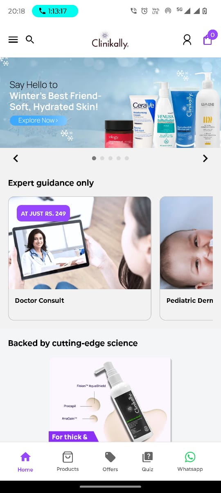
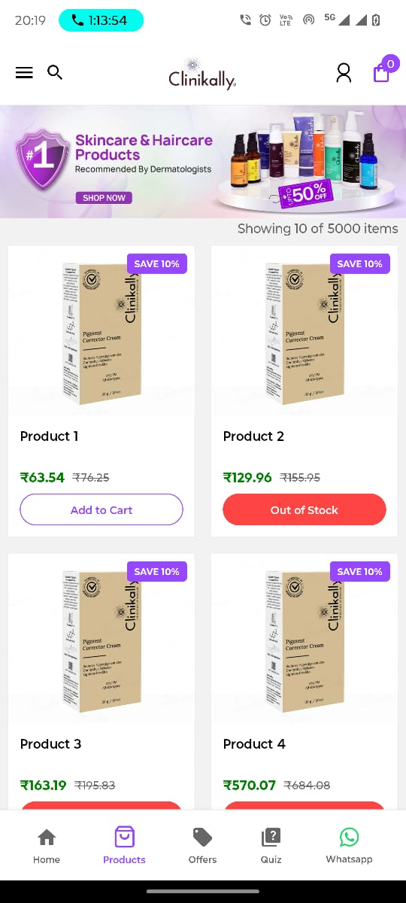
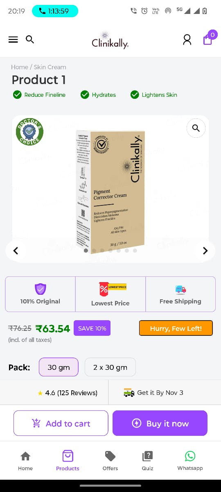
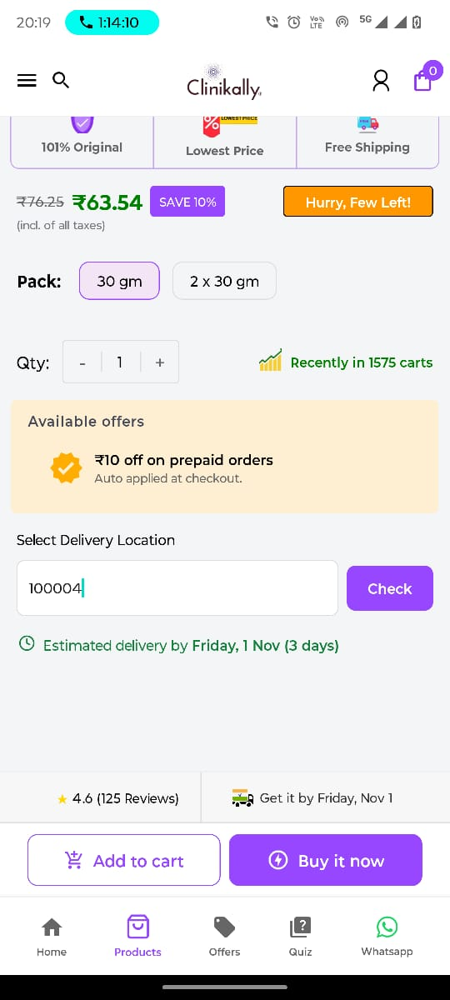

<h1>🏥 <strong>Clinikally</strong> - Your Streamlined Healthcare Experience</h1>

Welcome to <strong>Clinikally</strong>, a React Native application designed to simplify and enhance the healthcare experience by making it easy to access products, check availability, and get delivery estimates—all in one place. Follow the guide below to set up and explore the application's core features!

<h2>📑 Table of Contents</h2>
<ul>
  <li><a href="#getting-started">Getting Started</a></li>
  <li><a href="#main-features">Main Features</a></li>
  <li><a href="#screenshots">Screenshots</a></li>
  <li><a href="#live-access">Live Access</a></li>
  <li><a href="#explore-clinikally">Explore Clinikally</a></li>
</ul>

<h2 id="getting-started">🚀 <strong>Getting Started</strong></h2>

To set up <strong>Clinikally</strong> on your local machine, follow these simple steps:

<h3>1. Clone the Repository</h3>
<pre><code>git clone https://github.com/Avenster/clinikally-project.git</code></pre>

<h3>2. Navigate to the Project Directory</h3>
<pre><code>cd clinikally-project</code></pre>

<h3>3. Clean Up Existing Dependencies</h3>

Remove outdated or unnecessary dependencies.

<pre><code>rm -rf node_modules</code></pre>
<pre><code>rm package-lock.json</code></pre>

<h3>4. Install the Dependencies</h3>
<pre><code>npm install</code></pre>

<h3>5. Run the Application</h3>

Specify the platform by replacing <code>&lt;your_platform&gt;</code> with either <code>ios</code> or <code>android</code>.

<pre><code>npm run &lt;your_platform&gt;</code></pre>

<h2 id="main-features">✨ <strong>Main Features</strong></h2>

Explore the essential features of <strong>Clinikally</strong> that make it a convenient and efficient healthcare app:

<h3>1. Product Selection & Availability Simulation</h3>
<ul>
  <li>Browse a list of healthcare products with simulated stock availability to ensure an interactive experience.</li>
  <li>Approximately 80% of products are in stock to provide a realistic shopping scenario.</li>
</ul>

<h3>2. Pincode Input & Validation</h3>
<ul>
  <li>Input and validate pincodes to associate users with the correct logistics provider for precise delivery estimates.</li>
  <li>Invalid pincodes trigger alerts, improving the user experience with real-time validation.</li>
</ul>

<h3>3. Delivery Date Estimation Logic</h3>
<ul>
  <li>Accurately calculates delivery estimates based on the selected provider and pincode:</li>
  <ul>
    <li><strong>Provider A</strong>: Same-day delivery if ordered before 5 PM (subject to stock availability).</li>
    <li><strong>Provider B</strong>: Same-day delivery if ordered before 9 AM, otherwise next-day delivery.</li>
    <li><strong>General Partners</strong>: Delivery within 2-5 days based on user location.</li>
  </ul>
</ul>

<h3>4. Same-Day Delivery Countdown Timer</h3>
<ul>
  <li>Displays a countdown timer for orders with Providers A and B, letting users know the remaining time to qualify for same-day delivery, adding a sense of urgency.</li>
</ul>

<h3>5. Smart Date & Time-Aware Delivery Estimation</h3>
<ul>
  <li>The app intelligently factors in the current date and time to ensure that cutoff times are applied accurately, making delivery estimates more precise.</li>
</ul>

<h2 id="screenshots">📸 <strong>Screenshots</strong></h2>

Below are some screenshots of <strong>Clinikally</strong> in action, showcasing its intuitive interface and key features:

<table>
  <tr>
    <th>Product List</th>
    <th>Delivery Options</th>
    <th>Pincode Validation</th>
    <th>Countdown Timer</th>
  </tr>
  <tr>
    <td></td>
    <td></td>
    <td></td>
    <td></td>
  </tr>
</table>

<h2 id="live-access">🌐 <strong>Live Access</strong></h2>

The application is hosted and ready to be explored. Access <strong>Clinikally</strong> using the link below or by scanning the QR code for quick access:

<ul>
  <li><strong>App URL</strong>: <a href="https://your-app-hosting-url.com">https://your-app-hosting-url.com</a></li>
</ul>

  

<h2 id="explore-clinikally">🎉 <strong>Explore Clinikally</strong></h2>

Dive into <strong>Clinikally</strong> and experience a modern healthcare app that keeps your convenience at the forefront. From product selection to timely delivery estimates, Clinikally is here to streamline your healthcare journey.

<strong>Happy Exploring!</strong>

